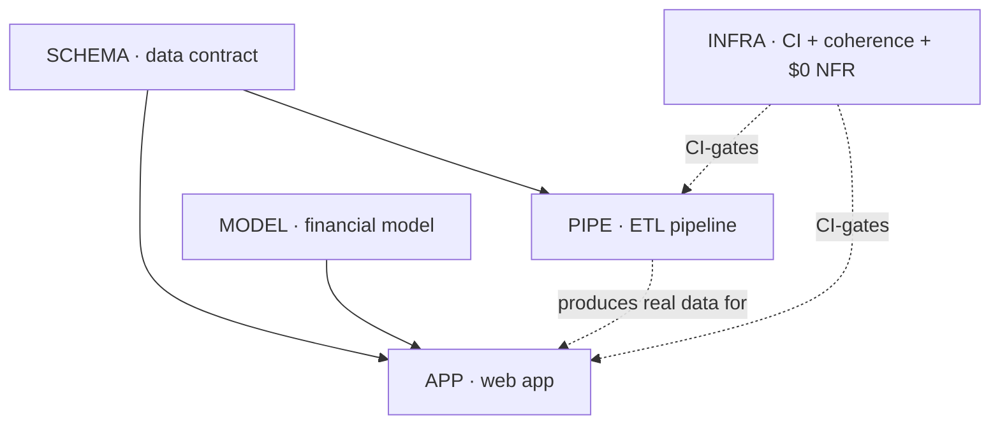

# Parallel Workstreams

How several agents work this project at once without colliding. The rule: **agree the seams
first, then build behind them.** Two seams carry all the coordination; once they're pinned,
the segments below run independently.

## The two seams (do these first, together)

| Seam | File | Unblocks |
|---|---|---|
| **Data contract** | `contract/metros.schema.json` + `contract/metros.sample.json` | PIPE (builds *to* it) and APP (builds *against* the fixture) |
| **Model interface** | `packages/model/src/index.ts` (types + signatures) | APP (imports the types/functions) and MODEL (implements them) |

Both seams exist in skeleton form already. They are the only cross-segment agreements. Change
one and you ripple across segments — so changes to these go through a review stop (they are
`SCHEMA`/`MODEL` segment changes, cascaded deliberately, not casually).

## Segments (one owner each, run in parallel after the seams)

| Segment | Prefix | Owns | Depends on | Can start |
|---|---|---|---|---|
| Data contract | `SCHEMA` | `metros.json` schema, fixture, a validation test both sides share | — | ✅ **done** |
| Financial model | `MODEL` | amortization, net-worth recurrence, breakeven; per-year schedules | contract types | now (against the interface stub) |
| ETL pipeline | `PIPE` | config-driven fetch → join → emit `metros.json` **+ its Actions ETL workflow & publish** | SCHEMA | ready now (SCHEMA done) |
| Web app | `APP` | metro selector, crossover chart, assumptions dials, wiring **+ its Pages deploy** | SCHEMA (fixture), MODEL (interface) | after both seams are agreed; builds on the **fixture**, not on PIPE |
| Infrastructure | `INFRA` | CI (all tests + fixture validation) + the LID coherence-check script + the $0 NFR | — | anytime *(ETL cron → PIPE; Pages deploy → APP)* |

**Key unblock:** APP never waits for PIPE. It develops against `contract/metros.sample.json`.
When PIPE produces the real file in the same shape, APP consumes it with no change. That's the
whole point of the contract.

## How to pick up a segment (each is its own LID arrow)

Each segment walks the workflow independently, with its own review stops:

1. **LLD** — flesh out `agent-docs/llds/<segment>.md` (currently a skeleton). Stop for review.
2. **EARS** — fill `agent-docs/specs/<prefix>.md` with the segment's specs. Stop for review.
3. **Edge audit** — resolve cross-spec ambiguity, especially where your segment meets another
   at a seam. Stop for review.
4. **Tests first** — write failing tests carrying `@spec <ID>` annotations.
5. **Code** — implement to green, annotate entry points with `@spec`.

Cascade within your segment is free. Anything that changes a **seam** (`SCHEMA` or the `MODEL`
interface) crosses into other segments — pause and coordinate.

## Suggested first moves for a team of agents

- **Agent A → SCHEMA:** ✅ **done** — `metros.schema.json` + fixture + `contract/metros.test.ts`
  (11 passing conformance tests). Everyone else keys off this. *(Remaining polish, when useful:
  expand the fixture to more realistic metros.)*
- **Agent B → MODEL:** implement the recurrence and breakeven against the interface stub; this
  is pure and testable with zero external data — the cleanest parallel start.
- **Agent C → APP:** build the dashboard against the fixture + the model interface.
- **Agent D → PIPE:** implement the config-driven ETL to emit a file that validates against the
  schema.
- **Agent E → INFRA:** wire CI (all segments' tests + fixture validation) and the LID
  coherence-check script. *(The ETL cron is PIPE's; the Pages deploy is APP's.)*

## Open coordination questions

- The four assumed decisions in `CLAUDE.md` are unconfirmed. If compute moves server-side, a
  `BACKEND` segment appears between the app and the model; the model interface is designed to
  survive that move unchanged.
- Exact metro coverage (the ZHVI ∩ ZORI ∩ tax intersection) is discovered by PIPE, not
  hand-picked — see the PIPE LLD.
