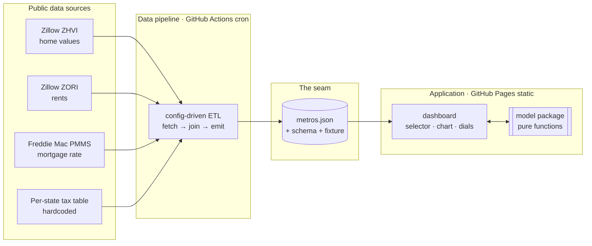

# High-Level Design: Rent vs. Buy Longitudinal Tool

> One HLD per project. This is the shared map for every agent. Keep it short enough to
> re-read. Mutate in place; delete what's wrong.

## Problem

Anyone deciding whether to buy or rent a home reaches for an online calculator. The
common ones give a single confident answer, hide the assumptions behind it, and quietly
extrapolate the last few years — which is how tools screamed "buy" in 2021.

The honest form of the question is conditional: *given assumptions I can see and change,
how does buying compare to renting for my net worth 1–10 years out, in my metro?* No free
tool shows its work, expresses the future as a range instead of a line, and lets a person
move the assumptions — including on a per-year basis. That gap is the reason to build this.

## Approach

Two subsystems joined by one narrow contract.

### Data pipeline (config-driven ETL)

A scheduled job gathers current, public housing data — home values, rents, the mortgage
rate, per-state property tax — and emits **one static data file per run** (`metros.json`).
It is driven by a config that declares its sources, not by hand-written per-source code.

Crucially, **the pipeline computes no decisions.** It assembles *facts about each metro* plus
the *default assumptions*, and emits them as one file. All model math lives elsewhere. This
keeps the pipeline's job small and its language choice independent of the model's.

### Application (static, model runs in the browser)

A static web app loads `metros.json` and runs a transparent net-worth model **live, in the
browser**, as the user flexes assumptions. The model is cheap — a handful of loops over ten
years — so recomputing on every slider move is instant. That is why there is **no compute
server**: adding one would be cargo-culting a cost and a failure mode the workload doesn't
justify.

### Two disciplines that make it hold together

- **The data contract is the primary seam.** A published JSON schema plus a committed
  *sample fixture*. It carries per-metro observed facts **and** a global `defaults` block of
  every assumption default. The pipeline builds *to* it; the app builds *against* it. Either
  side can be built and demoed end-to-end before the other exists. This is what lets
  independent agents work in parallel without blocking each other.
- **The model is a pure, portable module.** Metro facts and assumptions in, the full year-by-year
  picture out — home price, loan balance, equity, both investment accounts, rent, each side's net
  worth — no I/O. **Inflation is not a free input: it gravitates to a fixed 2% anchor over
  the horizon — a built-in law of the model, like gravity, not a user dial.** The buyer's
  mortgage originates at today's rate and its forward path rides inflation plus a roughly
  constant premium, stabilizing as inflation does — used only to decide when to refinance.
  Appreciation and rent growth stay `inflation + a fixed spread`. The renter's starting position
  carries an upfront **security deposit** (recoverable — returned at the horizon) and a sunk
  **application fee**, mirroring the buyer's down payment and closing costs. It runs client-side
  today and can be lifted behind a serverless function later without the app noticing.

## Target Users

- **A person weighing a specific move** — "should I buy in Austin if I'll likely stay six
  years?" They distrust one-number calculators and want to see the assumptions and push on
  them. They need a defensible answer and the ability to make it *their* answer, at the cost
  of a few minutes of flexing dials.
- **(Secondary, later) a skeptical reader** who meets the tool posted publicly. For them the
  honesty — visible assumptions, ranges not lines — is what survives scrutiny.

## Goals

- A user picks a metro and, on one screen, sees the buy-vs-rent net-worth trajectories over 10
  years, where (or whether) they cross, and the exact assumptions used.
- A user changes any *adjustable* assumption and the projection updates instantly, with no page
  reload and no server round-trip. (Inflation and the mortgage's forward path are model-determined,
  not dials — see System Design.)
- The whole system runs at **$0**: ETL on GitHub Actions, app on GitHub Pages, no paid
  hosting and no paid data.
- The two subsystems are **buildable in parallel** by independent agents, blocked only by the
  shared contract, never by each other.

## Non-Goals

- **Not a forecaster.** It computes outcomes *conditional on* stated assumptions and never
  claims to predict prices. Defaults anchor to long-run fundamentals, never the recent trend.
- **No live/streaming market data.** The ETL snapshots data on a cron. "Real-time" here means
  the *interactive simulation*, not a live market feed.
- **No compute backend** — unless the "compute location" decision below is reversed.
- **No Monte Carlo / probabilistic paths.** v1 is deterministic. This is *not* a design driver:
  the model is no longer shaped around a future Monte Carlo.
- **No accounts, saved scenarios, auth, or database.**
- **No income tax — and therefore no deductions.** This world levies no income tax, so a
  mortgage-interest or property-tax deduction has nothing to offset. (Property tax itself *is*
  modeled, as a carrying cost.) **No HOA / PMI** in v1 either.

## System Design

The contract (`metros.json`) is the only thing that crosses the boundary between the
subsystems. The pipeline owns everything left of it; the app owns everything right of it;
the model is a self-contained module the app drives on every interaction.

**One file, one writer.** The contract carries the per-metro observed facts (price, rent, tax
rate) plus a global block of inputs — today's mortgage rate and the current inflation level —
and the *adjustable* assumption defaults (down payment, closing/selling costs, maintenance,
investment return, the spreads, refinance settings, and the renter's upfront costs — security deposit
and application fee, …). **The pipeline is the sole generator of `metros.json`;** the app
and model author no numbers of their own. Most defaults are user-overridable dials, but a few
mechanisms are **fixed and not dialable**: inflation gravitates to a **2% anchor**, and the
mortgage's forward path rides inflation. Every default-case result is reproducible from the
published file together with the model's fixed constants (the 2% anchor and the gravity law). The
model remains a pure function of `(metro facts, assumptions)`, seeded from the file.

## Key Design Decisions

| Decision | Chosen | Alternatives Considered | Rationale |
|---|---|---|---|
| Where simulation compute runs | **Client-side, in the browser** *(assumed — pending review)* | Free-tier compute backend | The model is microseconds; per-year slider recompute must be instant; a server adds cost, cold-starts, and a subsystem for no gain. A backend is justified only by heavy V2 compute, hiding the model, or secret-gated fetches — none present in v1. |
| What the pipeline produces | **Facts + assumption defaults** (`metros.json`), not model outputs | Pipeline precomputes fixed scenarios (per the MVP artifact); or defaults live in app code | The user wants *free* adjustment, which a fixed precompute can't serve — so the pipeline emits inputs, not decisions. Defaults ride in the same file (not in app code) so the file is the single writer and every default-case result is reproducible from it alone. |
| Subsystem boundary | **A published data contract** (schema + committed fixture) | Ad-hoc JSON shaped by whoever writes the pipeline first | The contract is the narrow interface (PoSD). Agreeing it first lets the app build against a fixture and the pipeline build to a target — the mechanism for parallel work. |
| Model packaging | **Pure module, narrow rate params, no I/O** | Model logic embedded in React components | A deep module with a narrow interface: reusable in the browser now and behind a function later, and independently testable — the highest-correctness-value segment. |
| How rates evolve over the horizon | **Inflation gravitates to a fixed 2% anchor (a model law, not a user dial); the mortgage's forward path rides inflation and stabilizes with it** | Per-rate user-set linear drift; independent mortgage path; flat rates | The projection must anchor to long-run fundamentals, never the recent trend. Inflation reverting to ~2% is that anchor, so it is a fixed law the user cannot flex — the no-extrapolation principle made mechanical. Mortgage rates historically track inflation plus a term premium, so deriving the forward path from inflation keeps them coherent and self-stabilizing; it feeds only the refinance decision. |
| Pipeline language | **Python + pandas** *(assumed — pending review)* | All-TypeScript monorepo | The Zillow CSVs are wide (a column per month); pandas `melt`/`merge` makes the reshape ~10 lines. Decoupled from the model because the pipeline runs no model. |
| Repo topology | **Single monorepo** *(assumed — pending review)* | Separate repo per subsystem | Keeps the contract and fixture in one place and coherent; less cross-repo versioning friction for a solo/free project. |
| Hosting | **GitHub Actions (ETL) + GitHub Pages (app)** | Vercel (per the MVP artifact) | The $0 non-functional requirement. Actions gives batch/cron for free; Pages serves a static app for free. |

## Success Metrics

Stated as falsification signals — the conditions under which this design is *broken*:

- **Interactivity:** if changing an assumption requires a page reload or a network call, the
  "instant simulation" goal has failed.
- **Parallelism:** if the app cannot be built and demoed against the committed fixture with no
  pipeline in existence, the seam has leaked and the subsystems are coupled.
- **Cost:** if any part requires a paid tier to run at expected volume, the $0 NFR is broken.
- **Honesty / reproducibility:** if a metro's net-worth trajectories under default assumptions can't
  be reproduced from the published `metros.json` together with the model's published constants (the 2%
  anchor and the gravity law), hidden state has crept in.
- **No-extrapolation:** if the shipped default appreciation tracks the recent trend rather than
  a long-run prior, the core design principle has been violated.

## FAQ

**Why no backend when the prompt asked for one?** The only "backend-shaped" work here is
gathering data on a schedule, which GitHub Actions does for free. The decision computation is
tiny and belongs next to the interaction, in the browser. A running server would be a cost and
a failure mode with nothing to do. If a future feature needs server-side compute, the model is
already a portable module ready to move — see the compute-location decision.

**What does "real-time" mean here?** Two clocks. Data freshness is the cron ETL (e.g. weekly).
The *simulation* is real-time in the sense that matters to a user: it recomputes the instant you
move a dial. It is not a live market feed.

**Where do the model's default numbers come from?** Long-run fundamentals, never the recent trend.
Inflation is the anchor: it starts from the current reading and gravitates to a fixed **2%** over the
horizon — a built-in law of the model, not a user-facing dial. Appreciation and rent growth are
`inflation + a small fixed real spread`; the buyer's mortgage originates at today's observed rate and its
forward path rides inflation plus a roughly constant premium. The pipeline writes the starting values and
the adjustable defaults into `metros.json`; the 2% anchor and the gravity law are fixed model constants.
They are principled priors, not predictions.

## References

- `artifacts/rent-vs-buy-mvp-spec.md` — the originating MVP product doc (a map, not the territory).
- `artifacts/buy-vs-rent-data-sources-and-formulas.md` — where each input comes from, and formulas.
- `artifacts/buy-vs-rent-rates-and-values.md` — the rate/value taxonomy underlying the model.
- `artifacts/buy-vs-rent-variables.md` — the full cost/benefit variable reference.
- `agent-docs/PARALLEL-WORKSTREAMS.md` — how the segments below are picked up in parallel.
- LLDs: `agent-docs/llds/` · EARS specs: `agent-docs/specs/`
